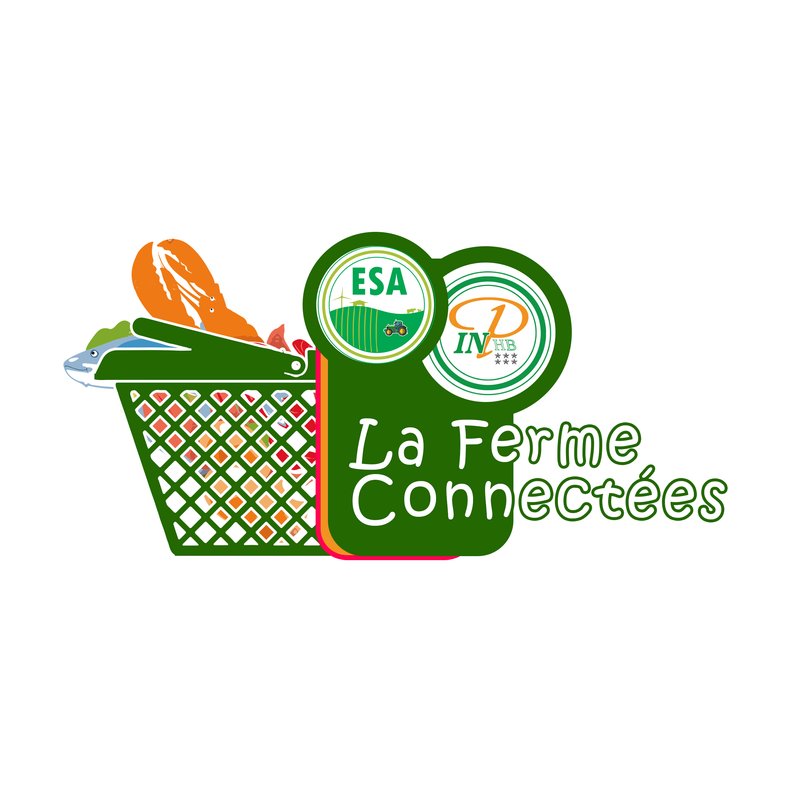

# Presentation projet
## Nom du projet :
*ESA FermeConnecte*
## Logo

## Description

Application web de commande en ligne des produits de la grande ferme de l'ESA/INP-HB.

## Fonctionnalités
1. Creer un compte utilisateur
2. Connexion à son compte
3. Rechercher une produit dans le catalogue des produits disponibles
4. Ajouter un produit et la quantité souhaité à son panier
5. Planifier sa commande et le mode de paiement
6. Contacter les gestionnaires de la ferme

## Configuration de l'environnement de travail

Pour configurer votre environnement de travail, vous devez suivre les étapes suivantes:

### Clonner le repertoire de travail
Executer dans le terminal dans votre dossier de travail la commande suivante:

```bash	
git clone https://github.com/Mr-KAM/FermeConnecte.git
cd FermeConnecte
```

### Configurer l'environnment python

1- Vous devez creer un environnment virtuel. Installez **pew** via la commande:

```bash	
pip install pew
```

2- Creez un environnement virtuel 

```bash	
pew new fermeconnecte
```

3- Installez les dependences python

```bash	
pip install -r requirements.txt
```

### Lancez l'application flask

Pour executer l'application vous devez faire en ligne de commande dans le répertoire de travail:

```bash	
python app.py
```
# Spécifications techniques

## Technologies

FrontEnd :
----------
- html
- css
- js

BackEnd:
--------
- python3 
	+ Framework : Flask
	+ Database : Deta Base
	+ Storage : Deta Drive
	
Le dévéloppement actuelle de l'application se fait avec la technologie du microframework python **flask**.
La base de données et la gestion de fichiers est gérer actuellemnt avec Deta.


## Arboressence

```bash
C:.
│   .gitignore
│   app.py
│   config.py
│   Makefile
│   models.py
│   readme.md
│   requirements.txt
│   setup.py
│
├───Impact
│   │   blog-details.html
│   │   blog.html
│   │   index.html
│   │   portfolio-details.html
│   │   Readme.txt
│   │   sample-inner-page.html
│   │
│   ├───assets
│   │   ├───css
│   │   │       main.css
│   │   │
│   │   ├───img
│   │   │   │   about-2.jpg
│   │   │   │   about.jpg
│   │   │   │   apple-touch-icon.png
│   │   │   │   breadcrumbs-bg.jpg
│   │   │   │   cta-bg.jpg
│   │   │   │   favicon.png
│   │   │   │   hero-bg-abstract.jpg
│   │   │   │   hero-img.svg
│   │   │   │   stats-img.svg
│   │   │   │
│   │   │   ├───blog
│   │   │   │       blog-1.jpg
│   │   │   │       blog-2.jpg
│   │   │   │       blog-3.jpg
│   │   │   │       blog-4.jpg
│   │   │   │       blog-5.jpg
│   │   │   │       blog-6.jpg
│   │   │   │       blog-author-2.jpg
│   │   │   │       blog-author-3.jpg
│   │   │   │       blog-author-4.jpg
│   │   │   │       blog-author-5.jpg
│   │   │   │       blog-author-6.jpg
│   │   │   │       blog-author.jpg
│   │   │   │       blog-inside-post.jpg
│   │   │   │       blog-recent-1.jpg
│   │   │   │       blog-recent-2.jpg
│   │   │   │       blog-recent-3.jpg
│   │   │   │       blog-recent-4.jpg
│   │   │   │       blog-recent-5.jpg
│   │   │   │       comments-1.jpg
│   │   │   │       comments-2.jpg
│   │   │   │       comments-3.jpg
│   │   │   │       comments-4.jpg
│   │   │   │       comments-5.jpg
│   │   │   │       comments-6.jpg
│   │   │   │
│   │   │   ├───clients
│   │   │   │       client-1.png
│   │   │   │       client-2.png
│   │   │   │       client-3.png
│   │   │   │       client-4.png
│   │   │   │       client-5.png
│   │   │   │       client-6.png
│   │   │   │       client-7.png
│   │   │   │       client-8.png
│   │   │   │
│   │   │   ├───portfolio
│   │   │   │       app-1.jpg
│   │   │   │       app-2.jpg
│   │   │   │       app-3.jpg
│   │   │   │       books-1.jpg
│   │   │   │       books-2.jpg
│   │   │   │       books-3.jpg
│   │   │   │       branding-1.jpg
│   │   │   │       branding-2.jpg
│   │   │   │       branding-3.jpg
│   │   │   │       product-1.jpg
│   │   │   │       product-2.jpg
│   │   │   │       product-3.jpg
│   │   │   │
│   │   │   ├───team
│   │   │   │       team-1.jpg
│   │   │   │       team-2.jpg
│   │   │   │       team-3.jpg
│   │   │   │       team-4.jpg
│   │   │   │
│   │   │   └───testimonials
│   │   │           testimonials-1.jpg
│   │   │           testimonials-2.jpg
│   │   │           testimonials-3.jpg
│   │   │           testimonials-4.jpg
│   │   │           testimonials-5.jpg
│   │   │
│   │   ├───js
│   │   │       main.js
│   │   │
│   │   ├───scss
│   │   │       Readme.txt
│   │   │
│   │   └───vendor
│   │       ├───aos
│   │       │       aos.css
│   │       │       aos.js
│   │       │
│   │       ├───bootstrap
│   │       │   ├───css
│   │       │   │       bootstrap-grid.css
│   │       │   │       bootstrap-grid.css.map
│   │       │   │       bootstrap-grid.min.css
│   │       │   │       bootstrap-grid.min.css.map
│   │       │   │       bootstrap-grid.rtl.css
│   │       │   │       bootstrap-grid.rtl.css.map
│   │       │   │       bootstrap-grid.rtl.min.css
│   │       │   │       bootstrap-grid.rtl.min.css.map
│   │       │   │       bootstrap-reboot.css
│   │       │   │       bootstrap-reboot.css.map
│   │       │   │       bootstrap-reboot.min.css
│   │       │   │       bootstrap-reboot.min.css.map
│   │       │   │       bootstrap-reboot.rtl.css
│   │       │   │       bootstrap-reboot.rtl.css.map
│   │       │   │       bootstrap-reboot.rtl.min.css
│   │       │   │       bootstrap-reboot.rtl.min.css.map
│   │       │   │       bootstrap-utilities.css
│   │       │   │       bootstrap-utilities.css.map
│   │       │   │       bootstrap-utilities.min.css
│   │       │   │       bootstrap-utilities.min.css.map
│   │       │   │       bootstrap-utilities.rtl.css
│   │       │   │       bootstrap-utilities.rtl.css.map
│   │       │   │       bootstrap-utilities.rtl.min.css
│   │       │   │       bootstrap-utilities.rtl.min.css.map
│   │       │   │       bootstrap.css
│   │       │   │       bootstrap.css.map
│   │       │   │       bootstrap.min.css
│   │       │   │       bootstrap.min.css.map
│   │       │   │       bootstrap.rtl.css
│   │       │   │       bootstrap.rtl.css.map
│   │       │   │       bootstrap.rtl.min.css
│   │       │   │       bootstrap.rtl.min.css.map
│   │       │   │
│   │       │   └───js
│   │       │           bootstrap.bundle.js
│   │       │           bootstrap.bundle.js.map
│   │       │           bootstrap.bundle.min.js
│   │       │           bootstrap.bundle.min.js.map
│   │       │           bootstrap.esm.js
│   │       │           bootstrap.esm.js.map
│   │       │           bootstrap.esm.min.js
│   │       │           bootstrap.esm.min.js.map
│   │       │           bootstrap.js
│   │       │           bootstrap.js.map
│   │       │           bootstrap.min.js
│   │       │           bootstrap.min.js.map
│   │       │
│   │       ├───bootstrap-icons
│   │       │   │   bootstrap-icons.css
│   │       │   │   bootstrap-icons.json
│   │       │   │   bootstrap-icons.scss
│   │       │   │
│   │       │   └───fonts
│   │       │           bootstrap-icons.woff
│   │       │           bootstrap-icons.woff2
│   │       │
│   │       ├───glightbox
│   │       │   ├───css
│   │       │   │       glightbox.css
│   │       │   │       glightbox.min.css
│   │       │   │       plyr.css
│   │       │   │       plyr.min.css
│   │       │   │
│   │       │   └───js
│   │       │           glightbox.js
│   │       │           glightbox.min.js
│   │       │
│   │       ├───isotope-layout
│   │       │       isotope.pkgd.js
│   │       │       isotope.pkgd.min.js
│   │       │
│   │       ├───php-email-form
│   │       │       validate.js
│   │       │
│   │       ├───purecounter
│   │       │       purecounter_vanilla.js
│   │       │       purecounter_vanilla.js.map
│   │       │
│   │       └───swiper
│   │               swiper-bundle.min.css
│   │               swiper-bundle.min.js
│   │               swiper-bundle.min.js.map
│   │
│   └───forms
│           contact.php
│           Readme.txt
│
├───static
│   ├───css
│   │       style.css
│   │
│   ├───js
│   │       main.js
│   │
│   └───scss
│           style.scss
│
└───templates
        base.html
        index.html
```

## Réalisés:
Rien encore réalisé

## A faire

A définir

# Demos

